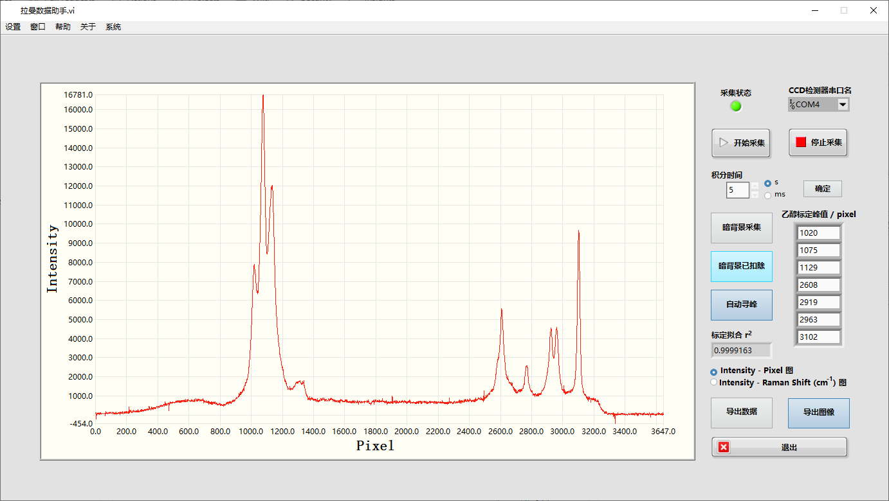
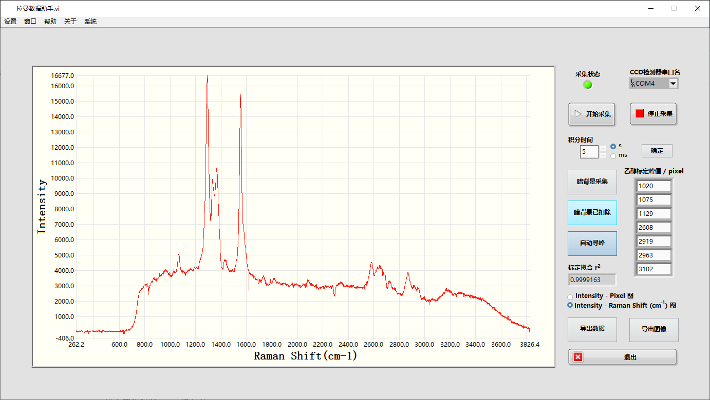

# 拉曼光谱数据助手 for 北京大学中级物理化学实验 2023.5

声明：本软件基于实验教学组提供的硬件进行设计，主要目的是给将来选修本课程的同学作为参考，请勿用作无关用途。

**使用方法**：下载拉曼数据助手.zip，解压到英文路径。

**基本功能**：数据显示、图表绘制、自动采集、暗背景扣除、自动寻峰和标定、图像转换等

**目录文件**：
* 拉曼数据助手.zip：可解压的应用程序压缩包
* Application：应用程序文件夹
* Programfiles：项目工程文件，使用LabVIEW2020编写和修改

软件演示视频：[【中物化实验】拉曼光谱搭建及演示](https://www.bilibili.com/video/BV1FT411t7Rm/)

##  基本功能  
1. 双击“拉曼数据助手.exe”，运行软件。
2. 如系统提示缺少引擎或驱动，按提示框步骤先安装引擎及驱动（<10M）。
3. 在“CCD检测器串口名”一栏选择合适的串口（Tips：建议重连CCD后先刷新，优先尝试新出现的串口）。
4. 点击“开始采集”，若串口选择正确，且CCD连接正常，此时应能显示图像，且采集状态指示灯亮。否则请检查串口选择是否正确，连接处是否松动。
5. 积分时间默认为0.1 s，可在“积分时间”一栏自行改变（拉曼光谱建议为1-5 s）。
6. 点击“停止采集”即可暂停采集，此时可按需要选择“导出数据”或“导出图像”，若要继续采集请点击“开始采集”。
7. 点击“退出”即可终止采集，自动断开CCD并退出软件。

##  暗背景扣除  
本软件开发了手动采集环境噪声，并自动扣除暗背景的功能，如需要请按以下步骤操作。
1. 在不打开光源的情况下点击“开始采集”，此时显示图像为暗背景。
2. 点击“暗背景采集”，等待时间略长于积分时间后再次点击以取消采集暗背景。
3. 点击“暗背景扣除”，即可扣除采集的暗背景。此时Indensity应在0附近很小的范围内波动（例如 $|I| < 100$）。
4. 打开光源，在暗背景扣除的条件下进行数据采集。

##  寻峰与图像转换  
本软件开发了自动寻峰与自动将“强度-像素图”转换为“强度-拉曼位移图”的功能，如需要请按以下步骤操作。
1. 用无水乙醇标定，点击“自动寻峰”即可按系统设定的范围（可在“设置-查看当前设置”中查看）自动寻峰，结果显示在“乙醇标定峰值”一栏，若 $r^2 > 0.9999$，且峰值无明显异常，则标定完成。
2. 否则，可选择手动设定寻峰范围（可在“设置-设置寻峰范围”中调整）后点击“自动寻峰”，或在“乙醇标定峰值”一栏手动输入峰值（无需点击自动寻峰）。
3. 标定完成且结果无异常后，可在界面右下方自行选择查看“强度-像素图”或“强度-拉曼位移图”，并按需求导出数据和图像（转换可能需要一定时间）。

##  重要提示  
1. 按上述步骤操作，若硬件正常，软件也应运行正常。
2. 若软件出现任何未知异常，首先尝试点击“系统-重置”重置状态；若无效，请尝试点击“系统-退出”或“退出”按钮断开设备并重新运行软件；若仍无效，尝试关闭软件并重新打开。
3. 如仍无法解决问题的，在确保硬件正常且连接正常的情况下，可以联系开发者咨询解决方案。

##  联系方式
1. 软件相关问题，请联系jxzengzw@outlook.com
2. 光路和仪器搭建问题，请联系enderwither@qq.com
